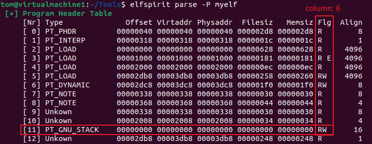

# elfspirit

[](#)
[](#)

[](https://github.com/liyansong2018/elfspirit/blob/main/LICENSE)

**elfspirit** is a useful program that parse, manipulate and camouflage ELF files. It provides a variety of functions, including parsing ELF like `readelf`, editing ELF like `010 editor`, adding section or segment, pathing ELF like `patchelf`, infecting ELF, deleting the section header table to increase the difficulty of reverse engineering. 

You might be familiar with popular open-source tools like [LIEF](https://github.com/lief-project/LIEF), [libelfmaster](https://github.com/elfmaster/libelfmaster), and [patchelf](https://github.com/NixOS/patchelf) (**Thanks for the inspiration and innovation that these tools have bestowed upon us!**). **elfspirit** distinguishes itself by offering not only enhanced flexibility in editing but also a What You See Is What You Get (WYSIWYG) editing perspective and unique features. Its primary objective is to empower hackers to effortlessly manipulate every byte of an ELF file. 

**For further information, refer to the [elfspirit wiki](https://github.com/liyansong2018/elfspirit/wiki) for a detailed exploration of its capabilities.**


## Building

**elfspirit** can be installed easily:

```shell
make
```

## Usage

### Analyze ELF format, like readelf

```shell
$ elfspirit parse -H myelf
 [+] ELF32 Header
     0 ~ 15bit ----------------------------------------------
     Magic:  7f 45 4c 46 01 01 01 00 00 00 00 00 00 00 00 00
            ELF E  L  F  |  |  |  |  |
                  32/64bit  |  |  |  |
            little/big endian  |  |  |
                         os type  |  |
                        ABI version  |
            byte index of padding bytes
     16 ~ 63bit ---------------------------------------------
     [ 0] e_type:                     0x2 (An executable file)
     [ 1] e_machine:                  0x3 (Sun Microsystems SPARC)
     [ 2] e_version:                  0x2 (Unkown)
     [ 3] e_entry:                 0x1077 (Entry point address)
     [ 4] e_phoff:                   0x34 (Start of program headers)
     [ 5] e_shoff:                 0x35d4 (Start of section headers)
     [ 6] e_flags:                  (nil)
     [ 7] e_ehsize:                  0x34 (Size of this header)
     [ 8] e_phentsize:               0x20 (Size of program headers)
     [ 9] e_phnum:                    0xb (Number of program headers)
     [10] e_shentsize:               0x28 (Size of section headers)
     [11] e_shnum:                   0x1d (Number of section headers)
     [12] e_shstrndx:                0x1c (Section header string table index)
```

### Freely edit every byte of ELF, not just 010 editor

We can easily edit any byte of ELF files using elfspirit, such as removing the stack non executable feature (`-z noexecstack`) of executable binary files.

The original PT_GNU-STACK segment only had read and write permissions (6=rw), as shown below



You can use elfspirit to grant executable permissions to the PT_GNU-STACK segment. Just set the parameters (i, j) to the coordinates of the target.

```shell
$ elfspirit edit -P -i11 -j6 -m7 myelf 
6->7
```

Wasn't this process a piece of cake?


### Patch IoT firmware for IDA

As is well known, the firmware of many embedded devices is bare metal programs without ELF header. Therefore, elfspirit can be used to add ELF header information, making it convenient to use reverse engineering tools such as IDA to decompile it.

```shell
# Add elf header for IoT firmware.bin
$ ./elfspirit addelfinfo -a arm -m 32 -e big -b 0x18308000 ~/Documents/app.bin
```

In addition, elfspirit also has the function of splicing firmware. A common situation we encounter is that IoT firmware has many bins stored in different partitions. They share an address space, and if you only analyze a single bin, you will find that the function jumps to an unfamiliar address. At this point, we need to use `elfspirit join`

```shell
# Connect multi-bin
$ ./elfspirit joinelf -a arm -m 32 -e big -c ./configure/bininfo.json ~/Documents/app.bin
```

### Patch ELF

* Change the ELF interpreter ("the dynamic loader/linker") of executables:

  ```shell
  elfspirit --set-interpreter [-s]<new interpreter> ELF
  ```

* Change the `RPATH` or `RUNPATH` of executables and libraries:

  ```shell
  elfspirit --set-rpath [-s]<rpath> ELF
  elfspirit --set-runpath [-s]<rpath> ELF
  ```

* Add section or segment of executables and libraries:

  ```shell
  elfspirit --add-section [-z]<size> ELF
  elfspirit --add-segment [-z]<size> ELF
  ```

### Infect ELF (experimental)

* Silvio text segment infectction technic:

  ```shell
  elfspirit --infect-silvio [-s]<shellcode> [-z]<size> ELF
  ```

* Reverse text segment infectction technic (Skeksi):

  ```shell
  elfspirit --infect-skeksi [-s]<shellcode> [-z]<size> ELF
  ```

* Data segment infectction technic (Skeksi):

  ```shell
  elfspirit --infect-data [-s]<shellcode> [-z]<size> ELF
  ```

## Limitations

**elfspirit** is a work in process, and some things still aren't implemented. We run **elfspirit** common function using :

- Ubuntu 22.04 / Kali Linux 2024.4

While other environments might be compatible, regrettably, we lack the resources to delve into potential compatibility issues. Given the absence of robust support for object-oriented programming in the C language and our constrained individual capabilities, there might exist redundant and unreasonable code within this project. Your understanding in this matter is greatly appreciated.

## License

**elfspirit** is open source software. See the `LICENSE` file for more details.